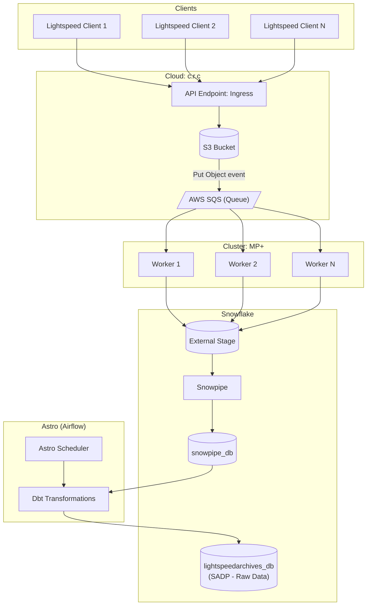
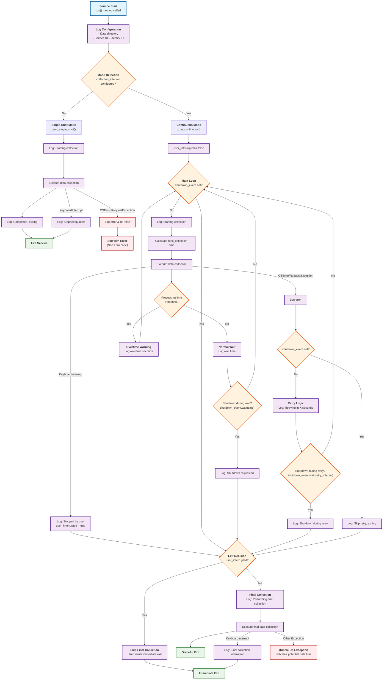

# Architecture Documentation

## System Architecture

The following diagram shows the overall system architecture and data flow:

**Note**: In Dataverse terminology, the `lightspeedarchives_db` serves as a **SADP (Source-Aligned Data Product)** - it contains all raw data from the source system. Client-specific **Aggregate Products** are created through DBT views that partition and filter this data by client/identifier, providing tailored access without duplicating the underlying data.

## Service Logic Flow

The Data Collection Service implements a robust flow with clear separation between single-shot and continuous operation modes.

### Overview

The service starts with configuration logging and mode detection, then delegates to specialized handlers:

- **Single-shot mode**: Execute one collection cycle and exit
- **Continuous mode**: Run periodic collection loop with graceful shutdown support

### Complete Logic Flow

### Exit Scenarios

| Exit Trigger | Final Collection | Behavior |
|-------------|------------------|----------|
| SIGTERM signal | ✅ Yes | Sets shutdown_event → graceful loop exit → final collection |
| Ctrl+C (KeyboardInterrupt) | ❌ No | Immediate exit from loop, no final collection |
| Single-shot completion | ❌ No | Normal exit after one collection cycle |

### Error Handling Strategy

| Error Type | Single-Shot Mode | Continuous Mode |
|------------|------------------|-----------------|
| KeyboardInterrupt | Log + Exit | Log + Exit (no final collection) |
| OSError/RequestException | Log + Re-raise | Log + Retry indefinitely* |
| Final Collection Error | N/A | Bubble up (indicates data loss) |

**\* Retry Behavior in Continuous Mode:**
- Service errors (OSError/RequestException) trigger retry logic
- Retries continue indefinitely until either:
  - The operation succeeds, OR  
  - A shutdown event is received during retry wait
- No final collection is performed for service errors alone
- Final collection only occurs when the main loop exits due to shutdown_event

This architecture ensures reliable data collection with appropriate responses to different termination scenarios while maintaining operational visibility through comprehensive logging.
